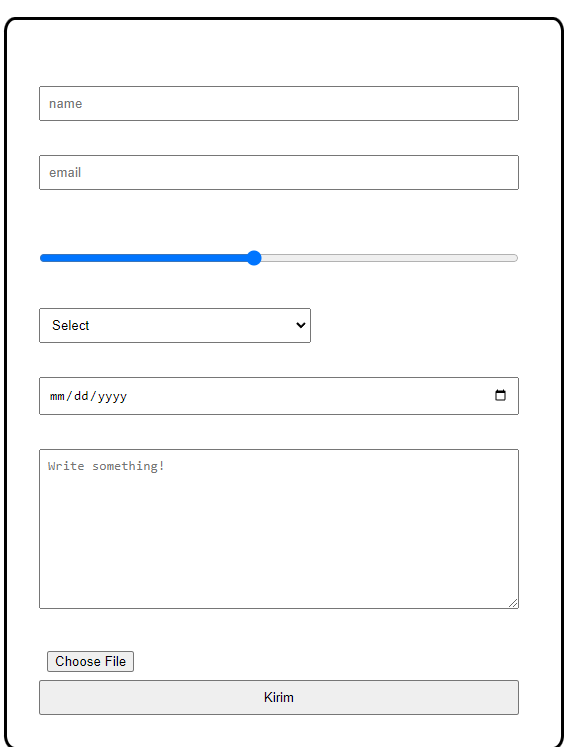

punya lu uda lebi clean skrg yul, lebih bagus tampilannya dibandingin dlu waktu ini pertama kali dibikin. poin poin feedbacknya:
1. bole tolong dibikin lebih bervariasi layoutnya, jangan keliatan di center doang satu layout pagenya
2. button carouselnya, sama titik birunya itu juga jangan sampe diatas navbarnya
[Lighthouse](assets/img/lighthouse-latest.png)
3. saat ganti ke dark mode, navbarnya, background formnya, sama yang background cewe wibu cakep itu, jadi dark juga ya.
4. Liat aja imagenya :D. Kayaknya gara" lu ubah smua text jadi putih, tapi formnya sendiri jg tetep putih.

5. Footernya juga dirapihin, fontnya samain kayak page biasa, sama gambar komputernya jangan artifact gitu